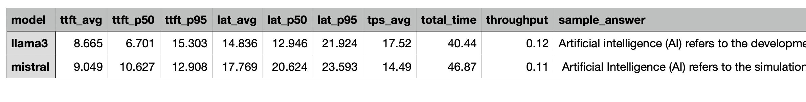

# Understanding LLM Performance Metrics and Locust Outputs

## 1. Introduction

Evaluating large language model (LLM) performance requires more than just measuring speed. You need to understand responsiveness, throughput, and consistency. This document explains key LLM performance metrics and how they relate to metrics provided by Locust, a popular load testing tool.

---

## 2. Core LLM Performance Metrics

### Time to First Token (TTFT)
**Definition:** Time from sending a request to receiving the first generated token.

- Measures initial responsiveness
- Includes queueing, preprocessing, and first inference step
- Critical for user-perceived latency in streaming applications

---

### Latency (LAT)
**Definition:** Total time from request start to full response completion.

- Also called end-to-end latency
- Includes network, queuing, and generation time

Variants:
- Full latency (entire response)
- Per-token latency (time between tokens)

---

### Tokens Per Second (TPS)
**Definition:** Token generation rate after the first token.

TPS = total tokens / generation time (excluding TTFT)

- Measures throughput
- Higher TPS = faster streaming output

---

## 3. Statistical Latency Metrics

### LAT_avg (Average Latency)
- Mean latency across all requests
- Sensitive to outliers

---

### LAT_p50 (Median Latency)
- 50th percentile
- Represents typical user experience
- More robust than average

---

### LAT_p95 (95th Percentile Latency)
- 95% of requests are faster than this value
- Highlights tail latency (slowest experiences)

---

### Why Percentiles Matter

Example:

| Metric   | System A | System B |
|----------|----------|----------|
| LAT_avg  | 2.0 s    | 2.0 s    |
| LAT_p50  | 1.5 s    | 1.0 s    |
| LAT_p95  | 2.2 s    | 5.0 s    |

- Same average
- Very different user experience
- System B has worse tail latency

---

In order to run the script benchmarkllm.py, you have to make sure that the two LLMs llama3 and mistral are installed and the ollama server is running.

$ ollama list
NAME              ID              SIZE      MODIFIED   
llama3:latest     365c0bd3c000    4.7 GB    2 days ago    
mistral:latest    6577803aa9a0    4.4 GB    2 days ago    
llama4:latest     bf31604e25c2    67 GB     6 days ago    

$ nohup ollama server > ollamaout.txt 2>&1 &

$ python benchmarkllm.py

This will generate a file called benchmark_results.csv with the following metrics as explained above.

  

 

---

## 4. Locust Metrics

Locust operates at the HTTP request level and provides the following:

### Request Metrics
- Total requests
- Failures
- Requests per second (RPS)

---

### Response Time Metrics
- Average response time → LAT_avg
- Median response time → LAT_p50
- Percentiles (p90, p95, p99) → LAT_p95, etc.
- Min / Max response time

---

### Distribution Metrics
- Response time histogram
- Helps visualize latency spread

---

### Reliability Metrics
- Failure count
- Error rate

---

## 5. What Locust Does NOT Provide

### TTFT
- Not measured by default
- Requires custom instrumentation

---

### TPS (Tokens Per Second)
- Not available natively
- Requires token counting and timing

---

### Token-Level Latency
- No built-in support
- Requires streaming-aware implementation

---

## 6. Extending Locust for LLM Metrics

### Measuring TTFT
- Use streaming APIs (SSE/WebSockets)
- Record:
  - Request start time
  - First token arrival time

---

### Measuring TPS
- Count tokens in response
- Measure generation duration
- Compute TPS manually

---

### Recommended Tracking
- TTFT (p50, p95)
- Full latency (p50, p95)
- TPS distribution

---

## 7. Summary Table

| Metric   | Description                     | Locust Support |
|----------|--------------------------------|----------------|
| TTFT     | Time to first token            | No (custom)    |
| LAT_avg  | Average full latency           | Yes            |
| LAT_p50  | Median latency                 | Yes            |
| LAT_p95  | Tail latency                   | Yes            |
| TPS      | Token generation speed         | No (custom)    |
| RPS      | Requests per second            | Yes            |

---

## 8. Key Takeaways

- TTFT determines responsiveness
- LAT determines total wait time
- TPS determines streaming speed
- Percentiles reveal consistency
- Locust is useful for system-level metrics but needs extensions for LLM-specific insights
